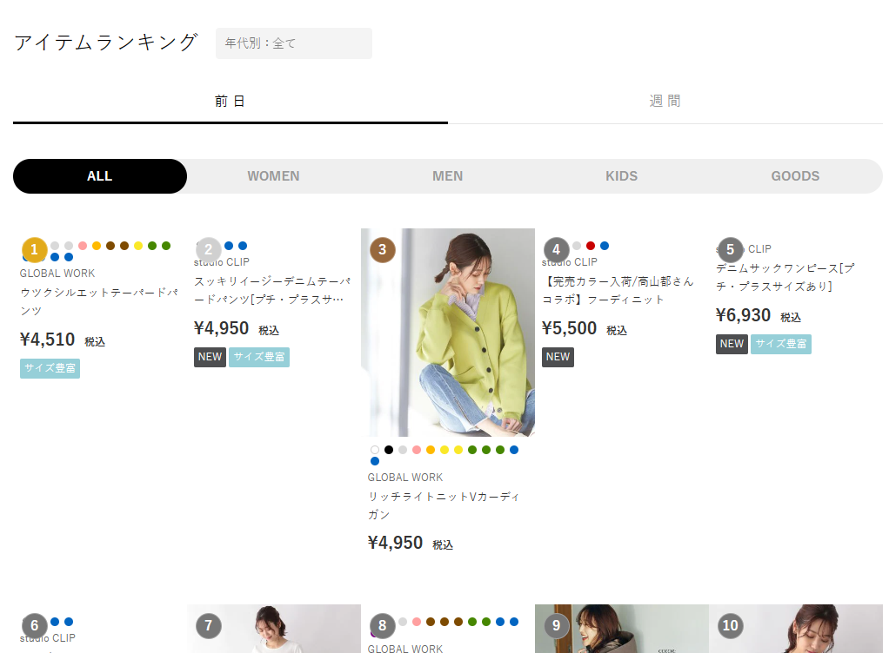
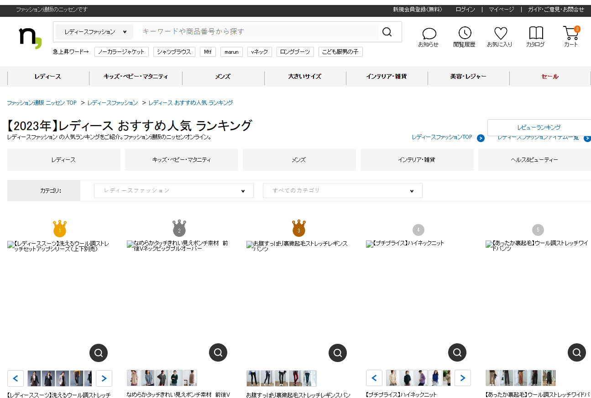
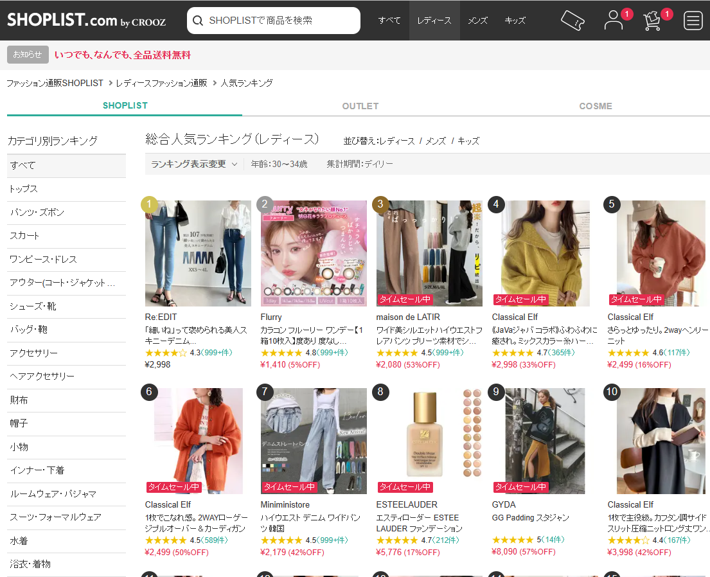
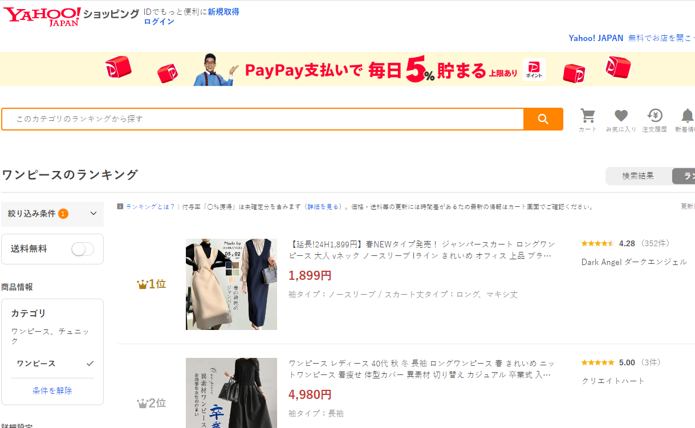
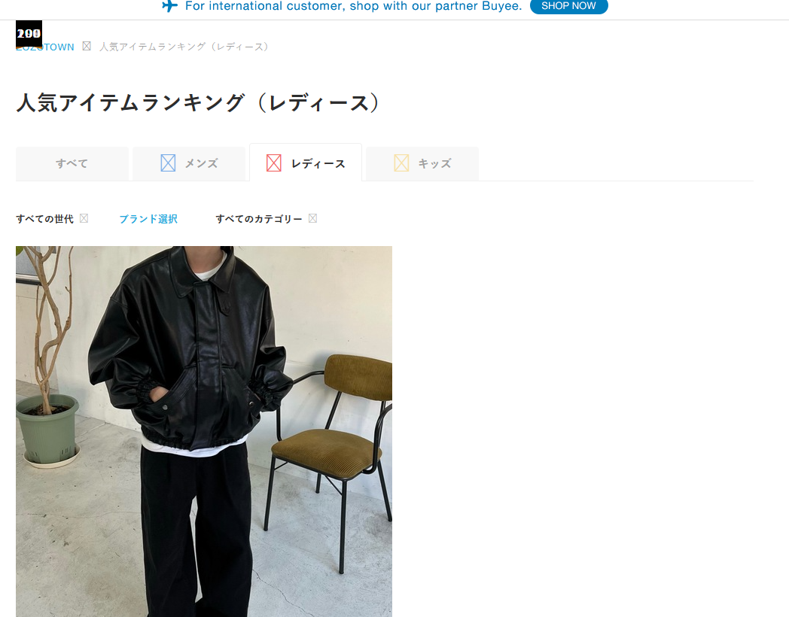

该工具用于提取如下站热销产品页面的产品信息，需要提供 html 或 mhtml 页面，自动保存为 json 文件。

# 使用
```go
go run . ZOZOTOWN_服装_热销榜_20230207_001.mhtml
或
go run . ZOZOTOWN_服装_热销榜_20230207_001.html
```
# 页面
## baycrews

## dot-st

## nissen

## rakuten

## shop-list

## yahoo

## zozotown
